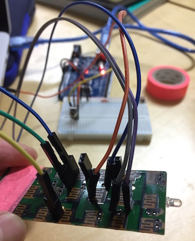
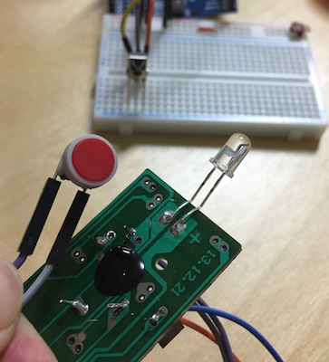

# IR-Switching
 - date : 2017/01/06
 - 간단한 셋업으로 무선 스위칭을 만들기 위한 해킹
 - 싱가폴 오픈미디어 페스티벌 워크숍 <Open Media Folders : 소통을 위한 코드와 스위치>에서 활용

 1. [Remote Control 38Khz](http://mechasolution.com/shop/goods/goods_view.php?goodsno=330445&category=054011)
 2. Sparkfun IR Control Kit 구형. (현재 단종 모델)
 3. RF 기반 LED 컨트롤러
 4. IR reciever
 5. YwRobot 에서 만든 IR 송수신 모듈
 6. 구로 리모콘 전문, 제이텍, 하단의 3개는 동작 안함.. 왜지?

## Prototyping #1

  
